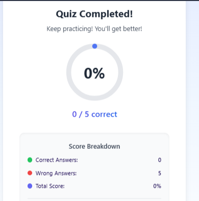

# Quiz Master



A dynamic and interactive quiz application with a futuristic dark-themed UI, engaging animations, and a smooth user experience. Quiz Master leverages LLaMA 3 AI to generate dynamic quiz questions on various topics and provides real-time feedback with visually appealing effects.

## ✨ Features

- **Topic Selection**: Choose from multiple categories to test your knowledge
- **AI-Generated Questions**: Dynamic questions created via LLaMA 3 API
- **Interactive UI**: Futuristic design with neon glows and animated elements
- **Real-time Feedback**: Immediate visual and audio feedback for answers
- **Performance Tracking**: Detailed statistics and performance history
- **Mobile Responsive**: Fully functional on all device sizes
- **Sound Effects**: Immersive audio feedback for interactions
- **Timed Questions**: 30-second timer per question with automatic progression

## 🚀 Tech Stack

- **Frontend**: React.js with TypeScript
- **Styling**: Tailwind CSS with custom animations
- **UI Components**: Shadcn UI component library
- **Animations**: Framer Motion for smooth transitions and effects
- **API Integration**: Axios for API calls
- **State Management**: React Hooks
- **API**: LLaMA 3 via Groq API
- **Sound Effects**: Custom audio implementation

## 📋 Prerequisites

Before you begin, ensure you have:

- Node.js (v14 or higher)
- npm or yarn
- A Groq API key for LLaMA 3 integration

## 🔧 Installation

1. **Clone the repository**

```bash
git clone https://github.com/yourusername/quiz-master.git
cd quiz-master
```

2. **Install dependencies**

```bash
npm install
# or
yarn install
```

3. **Environment setup**

Create a `.env` file in the root directory with:

```
GROQ_API_KEY=your_groq_api_key
```

4. **Start the development server**

```bash
npm run dev
# or
yarn dev
```

The application will be available at `http://localhost:5000`

## 📁 Project Structure

```
quiz-master/
├── client/                    # Frontend code
│   ├── src/
│   │   ├── components/        # Reusable UI components
│   │   │   ├── AnimatedTitle.tsx      # Animated text component
│   │   │   ├── ErrorState.tsx         # Error handling UI
│   │   │   ├── InteractiveButton.tsx  # Buttons with animations
│   │   │   ├── LoadingState.tsx       # Loading indicators
│   │   │   ├── QuizApp.tsx            # Main application component
│   │   │   ├── QuizQuestions.tsx      # Question display component
│   │   │   ├── QuizResults.tsx        # Results display
│   │   │   ├── StatsDisplay.tsx       # Statistics visualization
│   │   │   └── TopicSelection.tsx     # Topic selector component
│   │   ├── hooks/             # Custom React hooks
│   │   ├── lib/               # Utility functions and services
│   │   │   ├── api.ts         # API integration
│   │   │   ├── sounds.ts      # Sound effect handlers
│   │   │   └── userStatsService.ts  # Statistics tracking
│   │   ├── pages/             # Route components
│   │   ├── App.tsx            # App entry point
│   │   └── index.css          # Global styles
│   └── index.html             # HTML template
├── server/                    # Backend code
│   ├── api.ts                 # API endpoint definitions
│   ├── index.ts               # Server entry point
│   └── routes.ts              # Route handlers
├── shared/                    # Shared types and models
├── attached_assets/           # Images and other assets
├── package.json               # Project dependencies
├── tailwind.config.ts         # Tailwind configuration
└── README.md                  # Project documentation
```

## 🖥️ Usage

1. **Launch the application** by navigating to `http://localhost:5000`
2. **Select a topic** from the available categories
3. **Answer the questions** within the 30-second time limit
4. **Review your results** after completing all questions
5. **Track your progress** via the statistics panel

## 📊 Features in Detail

### Topic Selection
Choose from a variety of topics including Science, History, Geography, Movies, Technology, and more. Each topic features a unique emoji and animated entrance.

### Question Interface
Questions appear with a 30-second countdown timer. Select your answer and receive immediate visual feedback. Progress through questions with navigation buttons.

### Results Screen
After completing a quiz, see your score with animated confetti for high scores. Options to retry the quiz or choose a new topic.

### Statistics
Track your performance over time with detailed metrics:
- Overall accuracy
- Top performing topics
- Recent activity
- Performance trends

Each user's statistics are stored locally on their device using browser's localStorage. This means:
- Each user will have their own personalized stats
- Statistics persist between sessions on the same device
- Different users on different devices will have separate statistics data
- Statistics remain private to each user

## 🚢 Deployment

### Deploying on Vercel

1. **Create a Vercel account** at [vercel.com](https://vercel.com)
2. **Install Vercel CLI**:
   ```bash
   npm install -g vercel
   ```
3. **Login to Vercel**:
   ```bash
   vercel login
   ```
4. **Deploy the project**:
   ```bash
   vercel
   ```
5. **Add environment variables** in the Vercel dashboard:
   - `GROQ_API_KEY`: Your Groq API key

### Deploying on Replit

1. **Create a new Repl** from your GitHub repository
2. **Add secrets** in Replit:
   - `GROQ_API_KEY`: Your Groq API key
3. **Run the deployment** command:
   ```bash
   npm run dev
   ```

## 🧠 AI Integration

The Quiz Master uses LLaMA 3 via Groq API to generate dynamic quiz questions. The API:
- Creates questions based on selected topics
- Ensures diverse question types
- Provides accurate answers and explanations

## 📝 License

This project is licensed under the MIT License - see the LICENSE file for details.

## 🙏 Acknowledgements

- [React.js](https://reactjs.org/) - UI library
- [Tailwind CSS](https://tailwindcss.com/) - Styling framework
- [Framer Motion](https://www.framer.com/motion/) - Animation library
- [Groq](https://groq.com/) - AI API provider
- [Shadcn UI](https://ui.shadcn.com/) - UI component library